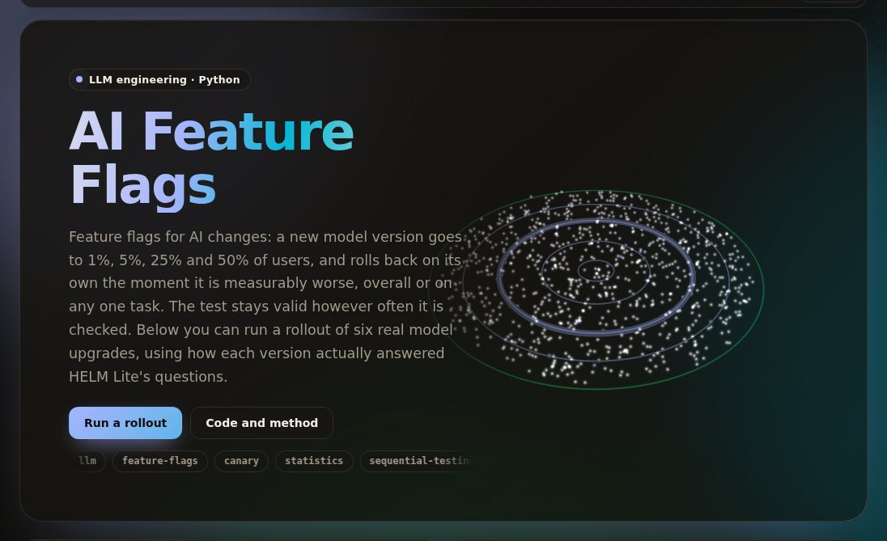

# ai-feature-flags

[](https://github.com/umer-78/ai-feature-flags/actions/workflows/ci.yml)

[](https://umer-78.github.io/ai-feature-flags/)

**Live demo:** https://umer-78.github.io/ai-feature-flags/ (roll a real model upgrade out in your browser and watch the guardrails)

Feature flags for AI features. You roll out a new model or prompt to 1%, 5%, 25% and then 50% of users. Each served request is scored, and the candidate is compared against the current version while the rollout runs. If it is measurably worse, overall or on any single segment, the flag rolls back to control by itself.

The rollout was replayed on real recorded answers from six model upgrades (HELM Lite). Results:

- The canary rolled back all three upgrades that were clearly worse (Gemini 1.5 Flash 002, Gemini 1.0 Pro 002 and Llama 3.1 70B), in 100 of 100 replays. Users saw 5 to 42 extra wrong answers, compared with 563 to 6,574 if everyone had been switched at once.
- Llama 3.1 scores 0.7 points lower overall but 10.9 points lower on legal questions. A guardrail on the overall score alone rolled it back in 1 of 100 replays; per-segment guardrails caught it in 100 of 100.
- With a candidate identical to control, the always-valid test rolled back 3.8% of rollouts, under its 5% bound. Re-running an ordinary significance test every 50 requests rolled back 45.9%.

## How it works

- **Flags.** Each flag has named variants (a model, a prompt, settings) and a control and a candidate. Optional targeting rules are checked first; the first match wins. `enabled: false` is the kill switch.
- **Sticky assignment.** A user's bucket is `sha256(flag:user) mod 10,000`, so a user gets the same variant on every request and server. Raising the rollout only moves users from control to the candidate, never back.
- **Staged canary.** The rollout stays at each stage for `stage_requests` scored requests and moves to 100% after the last stage. The application reports a 0–1 score per request (task success, a thumbs up, a grader's score) and optionally a segment.
- **Always-valid test.** The comparison is a one-sided mixture likelihood ratio (Johari et al., *Peeking at A/B Tests*, 2017), checked every 50 scored requests at every stage.
  - While the candidate is no more than `tolerance` (2 points) worse, the chance it ever fires is at most α = 5%.
  - Re-running a fixed-sample test at each check has no such bound (see the A/A table below).
- **Segment guardrails.** The test guards the overall score plus each listed segment, with Bonferroni correction across them. A regression confined to one feature can vanish in the average.
- Scores from users a targeting rule decided don't count, since those users weren't randomized. Scores reported while the flag is off don't count either.
- State (stage, counts, decision, log) is written to a JSON file, so a rollback survives a restart.

## Results

`python -m flags bench` replays each upgrade 100 times. Each replay is 80,000 requests: questions are drawn uniformly from the questions both versions answered, and users from a population of 20,000.

Each request is scored with the recorded correctness of the version that user was served. "Extra wrong answers" is how many more wrong answers users got than control would have given (median over replays). "Direct switch" is the expected count if every request had gone to the candidate.

| Upgrade | Overall | Guardrails | Rolled back | Median rollback | Extra wrong answers | Direct switch |
|---|---|---|---|---|---|---|
| GPT-4o 05-13 → 08-06 | 77.3% → 77.5% | overall | 0/100 | — | −22 | −123 |
| | | segments | 1/100 (openbookqa) | request 22,000 (5%) | −22 | −123 |
| Gemini 1.5 Pro 001 → 002 | 77.8% → 78.6% | overall | 0/100 | — | −141 | −686 |
| | | segments | 0/100 | — | −141 | −686 |
| Gemini 1.5 Flash 001 → 002 | 70.8% → 62.6% | overall | 100/100 | request 21,025 (5%) | 26 | 6,574 |
| | | segments | 100/100 (gsm8k −46 points) | request 11,350 (1%) | 10 | 6,574 |
| Gemini 1.0 Pro 001 → 002 | 60.8% → 57.5% | overall | 69/100 | request 57,700 (25%) | 309 | 2,672 |
| | | segments | 100/100 (legalbench, mmlu, openbookqa) | request 39,625 (5%) | 42 | 2,672 |
| Mistral Large 2402 → 2407 | 62.8% → 68.7% | overall | 0/100 | — | −954 | −4,761 |
| | | segments | 91/100 (math −7 points) | request 55,000 (25%) | −288 | −4,761 |
| Llama 3 70B → 3.1 70B | 74.7% → 74.0% | overall | 1/100 | request 25,600 (5%) | 129 | 563 |
| | | segments | 100/100 (legalbench −11 points) | request 27,450 (5%) | 5 | 563 |

Mistral Large 2407 is 5.9 points better overall and 7.3 points worse at math. The segment guardrails roll it back; whether that blocks the release is your call. Remove `math` from `segments` to guard only the rest.

**Identical candidate (A/A).** Each of the 12 versions was replayed against itself 100 times, with tolerance 0: the candidate sits exactly on the line the test guards, the hardest case for false alarms. Every rollback here is a false alarm.

| Test | Guardrails | False rollbacks | 95% interval |
|---|---|---|---|
| always-valid (this project) | overall | 45/1200 (3.8%) | 2.8%–5.0% |
| always-valid (this project) | segments | 51/1200 (4.2%) | 3.2%–5.5% |
| fixed-sample test re-run every 50 requests | overall | 551/1200 (45.9%) | 43.1%–48.7% |
| fixed-sample test re-run every 50 requests | segments | 612/1200 (51.0%) | 48.2%–53.8% |

Full tables are in `results/bench.md` and `results/summary.json`.

**Limits of the replay.**

- HELM questions stand in for production traffic, and each request's score is exact correctness. Real feedback is noisier and arrives later, which slows detection.
- In the replay, a candidate's true score on a task is its score on HELM's questions for that task.
- The "direct switch" column is an expected value, not a replay.

## Use

```bash
pip install -e '.[dev]'
python -m flags serve examples/flags.yaml --state state.json
```

```bash
# which variant this request gets
curl 'localhost:8000/flags/support-reply-model?user=u42&plan=free'
# {"flag": "support-reply-model", "variant": "control", "config": {"model": "gpt-4o-2024-05-13", "temperature": 0}, "reason": "rollout 1%"}

# how it went (0-1), with the segment it belongs to
curl -X POST localhost:8000/flags/support-reply-model/score \
  -d '{"user": "u42", "variant": "control", "score": 1, "segment": "billing"}'

curl localhost:8000/flags/support-reply-model/status                                  # stage, arms, decision, log
curl -X POST localhost:8000/flags/support-reply-model/enabled -d '{"enabled": false}'   # kill switch
```

In Python:

```python
from flags.core import Platform

flags = Platform.load("examples/flags.yaml", state_path="state.json")
served = flags.evaluate("support-reply-model", user_id, {"plan": "free"})
reply = call_model(**served["config"], prompt=prompt)
flags.score("support-reply-model", user_id, served["variant"], score=accepted, segment="billing")
```

Replay a single rollout, request by request:

```bash
python -m flags replay gemini-1.5-flash-001 gemini-1.5-flash-002
# gemini-1.5-flash-001 → gemini-1.5-flash-002: 4,551 questions, control 70.8%, candidate 62.6%
#   request 10,200: rolled back: gsm8k -42.9 points
```

Rerun the benchmark with `python -m flags bench` (about a minute once the data is cached), and the live demo's data with `python -m flags.demo`. HELM Lite's public results are downloaded on first use into `~/.cache/flags`; nothing is committed.

## Layout

- `flags/core.py`: flags, bucketing, targeting, and the platform that holds them (including the state file).
- `flags/canary.py`: stages, the always-valid test, and guardrails.
- `flags/server.py`: the HTTP API (standard library only).
- `flags/replay.py`: replays against HELM answers.
  - `live` sends one request at a time through the production code.
  - `fast` is a vectorized copy for the bench; tests check that the two make identical decisions.
- `flags/data.py` and `flags/versions.yaml`: the recorded answers.

## Licence

MIT licence (see [LICENSE](LICENSE)). The data it evaluates (HELM Lite's recorded results) keeps its own licence and is downloaded when you run it.
